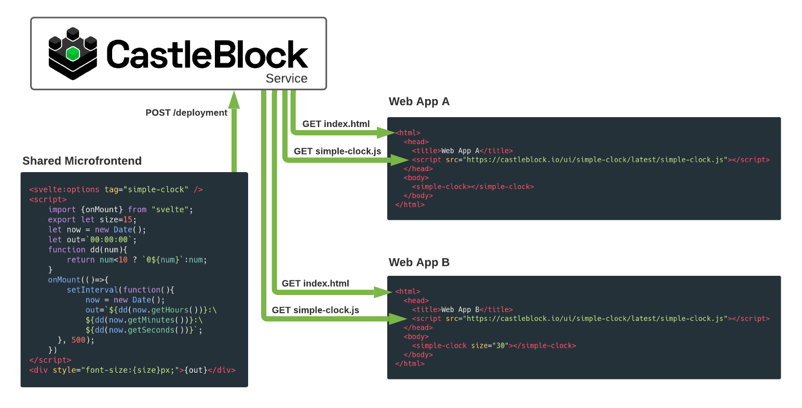

CastleBlock is a platform to host web applications and [web components](https://developer.mozilla.org/en-US/docs/Web/Web_Components) in one place. It's ideal for enterprise environments with multiple web applications that share common web components (with multiple versions).

CastleBlock consists of a [CLI](./castleblock-cli), a [service](./castleblock-service), and a [dashboard](./castleblock-ui). The CLI packages and uploads the web assets to the service. The service organizes the web assets and supports multiple hosted versions. The dashboard displays all of the deployed web assets in a catalog so components can be discovered and reused by other application developers.


## Features

- [CLI](./castleblock-cli) for manual deployments or continuous delivery
- [Dashboard](./castleblock-ui) for browsing deployed applications and components
- [Web Component delivery](#sharing-web-components) to downstream web applications
- Deployment versioning using [Semantic Versioning](https://semver.org/)
- [Environmental Variable Injection](./castleblock-cli#environmental-variable-injection)
- [Ad hoc deployments](./castleblock-cli#ad-hoc-deployments)
- Dynamic Swagger Documentation <http://localhost:3000/documentation>
- [manifest.json](./castleblock-cli#manifest.json) files are used to display app information in the CastleBlock UI
- [OAuth](https://github.com/greymatter-io/castleblock/tree/master/castleblock-service#authentication) support for many oauth [providers](https://hapi.dev/module/bell/providers) for user authentication.
- [JWT](https://github.com/greymatter-io/castleblock/tree/master/castleblock-service#issuing-jwt-tokens) for authorization
- [Reverse Proxy](./castleblock-service#reverse-proxy) for microservices in your environment
- [TLS Support](./castleblock-service#tls)

## Quick Start

- Bundle your project
- Run [castleblock-service](./castleblock-service) or use an existing instance
- Deploy your project with [castleblock-cli](./castleblock-cli)

```sh
castleblock deploy
```

## Sharing Web Components

CastleBlock lets you deploy web components that can then be integrated into your web applications. Rather than transpiling the component directly into each application you can deploy the individual components and load them at runtime. This allows the components to be developed and redeployed independently of your applications.



### Example Svelte Web Component

Making really small light weight web components in Svelte is easy; just define the tag at the top of your component. For a full example see [simple-clock](https://github.com/jmcudd/simple-clock).

```svelte
<svelte:options tag="simple-clock" />

<script>
  import { onMount } from "svelte";
  export let size = 15;
  let now = new Date();
  let out = `00:00:00`;
  function dd(num) {
    return num < 10 ? `0${num}` : num;
  }
  onMount(() => {
    setInterval(function () {
      now = new Date();
      out = `${dd(now.getHours())}:\
            ${dd(now.getMinutes())}:\
            ${dd(now.getSeconds())}`;
    }, 500);
  });
</script>

<div style="font-size:{size}px;">{out}</div>
```

### Integrating Web Components

Just include the bundled web component in the index.html file of your web application and then you can use the tag anywhere in your app. Then at load-time, the latest version of the components will be loaded. There is no need to rebuild the downstream app anytime the component gets updated.

```html
<html>
  <head>
    <title>Web App A</title>
    <script src="./ui/simple-clock/latest/simple-clock.js"></script>
  </head>
  <body>
    <simple-clock></simple-clock>
  </body>
</html>
```

## Development Environment

Spin up the [nix](https://nixos.org/guides/install-nix.html) shell by running `nix-shell` in the root of the project.

## Contribute

Check out the backlog of [planned features](https://github.com/greymatter-io/castleblock/issues?q=is%3Aopen+is%3Aissue+label%3Aenhancement), PRs are welcome.
