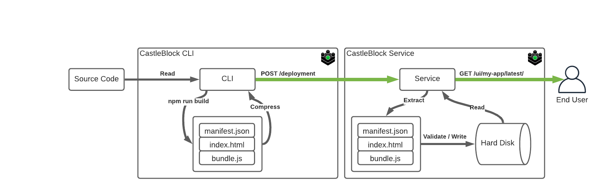

CastleBlock is Web Hosting as a Service with a CLI and Apps Catalog for discovery of deployed applications, microfrontend, and web components.



## Features:

- CLI for manual deployments or continuous delivery
- Deployment versioning
- Environmental Variable Support
- Reverse Proxy for CORS support
- Watch and deploy when files change
- Dynamic Swagger Documentation (http://localhost:3000/documentation)
- [manifest.json](https://developer.mozilla.org/en-US/docs/Mozilla/Add-ons/WebExtensions/manifest.json) files are used to display app information in the CastleBlock UI.
- Deploy Single Page Apps, Microfrontends, Web Components, any Web Asset
- CastleBlock UI for browsing deployed Apps, Microfrontends, and SPAs

## Quick Start

- Bundle your project
- Run [castleblock-service](./castleblock-service)
- Deploy your project with [castleblock-cli](./castleblock-cli)

```
castleblock-cli -n my-app -d ./dist
```


## Development Environment

Spin up the [nix](https://nixos.org/guides/install-nix.html) shell by running `nix-shell` in the root of the project.

## Coming Soon!

- Check out the backlog of [planned features](https://github.com/greymatter-io/castleblock/issues?q=is%3Aopen+is%3Aissue+label%3Aenhancement)
