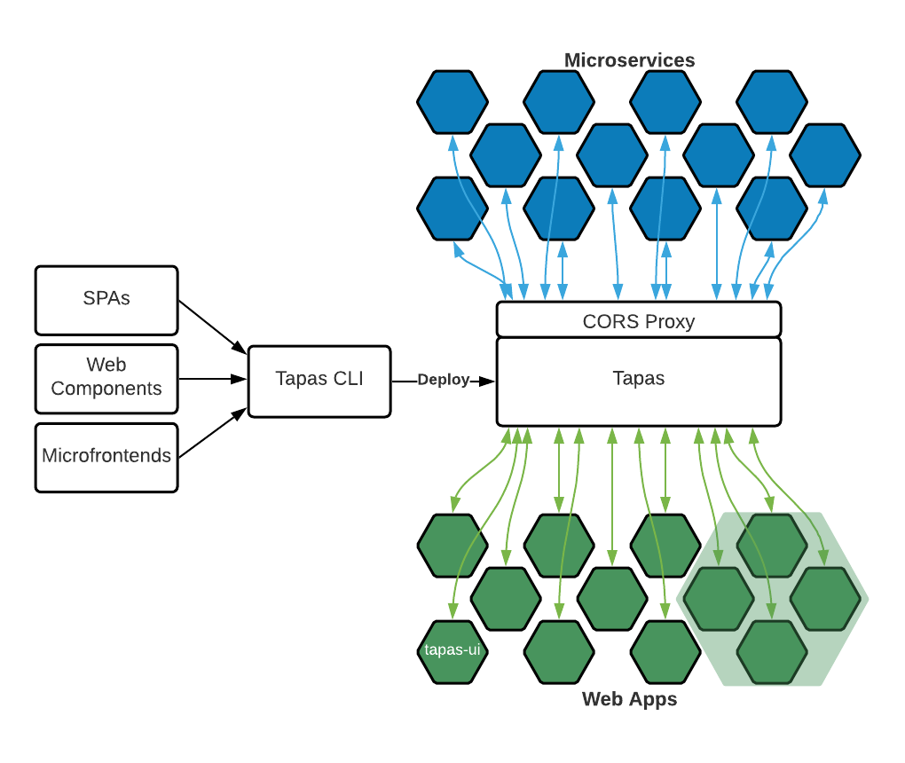

# Tapas

Build it. Deploy it. Share it.

Deploy your Web Components, Microfrontends, and Single Page Apps all in one place. Ideal for UIs, with no dedicated backends, that leverage existing microservices and APIs. Share WebComponents and Microfrontends across all of your SPAs. Updates to UIs are delivered automatically to downstream SPAs without the need to rebuild or redeploy any of your SPAs.



## Features:

- CLI for manual deployments or continuous delivery
- Deployment versioning
- Environmental Variable Support
- Deploy Single Page Apps, Microfrontends, Web Components, any Web Asset
- Tapas UI for browsing deployed Apps, Microfrontends, and SPAs

## Quick Start

- Bundle your project
- Run [tapas-service](./tapas-service)
- Deploy your project with [tapas-cli](./tapas-ui)

```
tapas-cli -n my-app -d ./dist
```


## Development Environment

Spin up the [nix](https://nixos.org/guides/install-nix.html) shell by running `nix-shell` in the root of the project.

## Comming Soon!

- Check out the backlog of [planned features](https://github.com/greymatter-io/tapas/issues?q=is%3Aopen+is%3Aissue+label%3Aenhancement)
